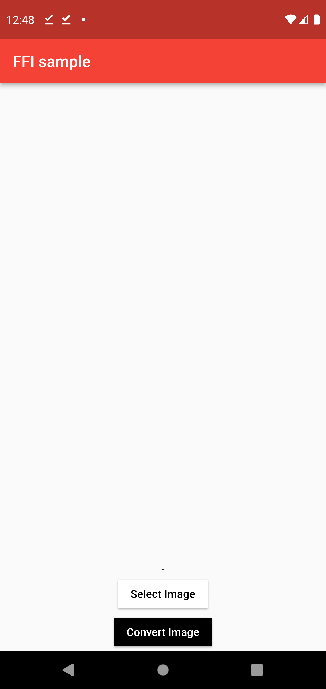
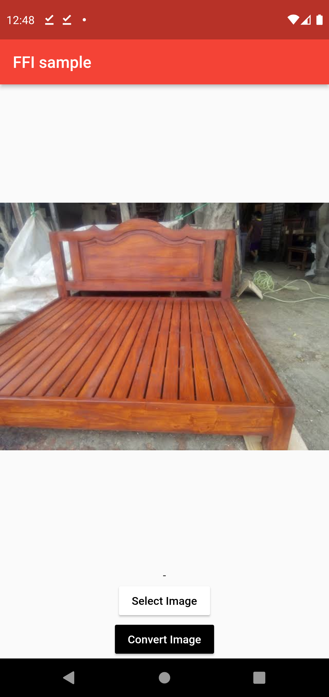
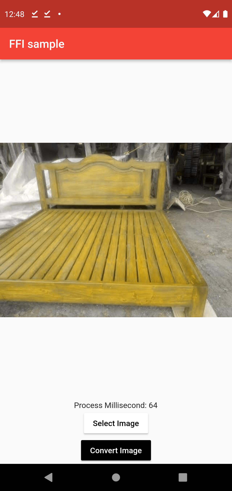

## Pigmentation - Color filter app in FLutter

A sample Flutter app for trying the c++ color changing module .

## Dependencies

<details>
     <summary> Click to expand </summary>
     
* [ffi](https://pub.dev/packages/ffi)
* [image_pixels](https://pub.dev/packages/image_pixels)
* [permission_handler](https://pub.dev/packages/permission_handler)
* [image_picker](https://pub.dev/packages/image_picker)

</details>

## Screenshots

| Welcome Page | Image Page | Converted Page |
| :----------: | :--------: | :------------: |

| <p>


</p> | <p>
    
</p> | <p>
    
</p> |

## Getting started

- You can simply run the code on any emulator and physical device.
- In case of any crash or error please check the project setup instructions at [Wiki](https://levelup.gitconnected.com/port-an-existing-c-c-app-to-flutter-with-dart-ffi-8dc401a69fd7) link.

## Directory Structure

<details>
     <summary> Click to expand </summary>
  
```
|-- lib
|   |-- main.dart
|   |-- ffi.dart
|-- pubspec.yaml
```

</details>
     
## Created & Maintained By

[Sait Burak Yucekaya](https://github.com/sait1801)
